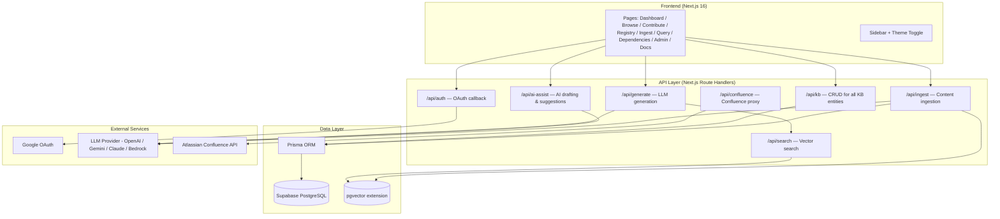

# Architecture Overview

## System Diagram



## Entity Hierarchy

```
Product (top-level — e.g., DMS, SFA, eB2B)
  └── Module (feature grouping — e.g., Promotion, Inventory)  [N:M with Product]
        └── Feature (knowledge document)
              └── Scenario (real-world workflow/flow)
```

- **Product** → Module is many-to-many (via `ProductModule` join table)
- **Module** → Feature is one-to-many (each feature belongs to exactly one module)
- **Feature** → Scenario is one-to-many

Features also carry `applicableProducts[]` to indicate which products they apply to beyond their module's default product links.

## Tech Stack

| Layer | Technology | Version |
|-------|-----------|---------|
| Framework | Next.js (App Router) | 16.x |
| Language | TypeScript | 5.x |
| ORM | Prisma | Latest |
| Database | Supabase PostgreSQL | 15+ |
| Vector Store | pgvector (Supabase extension) | Built-in |
| Auth | Supabase Auth (Google OAuth) | Built-in |
| Styling | Tailwind CSS v4 | 4.x |
| Deployment | Vercel | - |

## Directory Structure

```
knowledge-base/
├── prisma/
│   ├── schema.prisma        # Database schema (16 models)
│   ├── prisma.config.ts     # Prisma config (adapter)
│   └── seed-modules.ts      # Module data seeding script
├── src/
│   ├── app/
│   │   ├── api/
│   │   │   ├── kb/route.ts      # Unified KB API (GET + POST)
│   │   │   ├── generate/route.ts # RAG generation
│   │   │   ├── search/route.ts   # Vector search
│   │   │   ├── ai-assist/route.ts # AI drafting & suggestions
│   │   │   ├── ingest/route.ts    # Content ingestion (classify + confirm)
│   │   │   ├── confluence/route.ts # Confluence API proxy
│   │   │   └── auth/callback/    # OAuth callback
│   │   ├── page.tsx         # Dashboard
│   │   ├── browse/          # KB Browser (Product→Module→Feature→Scenario tree)
│   │   ├── contribute/      # Feature/Module/Scenario Editor
│   │   ├── registry/        # Entity Registry (manage/edit/delete all entities)
│   │   ├── ingest/          # Smart Content Ingestion (3-step wizard)
│   │   ├── query/           # Query & Generate
│   │   ├── dependencies/    # Dependency Graph
│   │   ├── admin/           # Admin Panel
│   │   ├── docs/            # Documentation & Guide
│   │   ├── layout.tsx       # Root layout
│   │   └── globals.css      # Design system (dark/light)
│   ├── components/
│   │   ├── Sidebar.tsx      # Navigation + theme toggle
│   │   ├── ThemeProvider.tsx # Dark/light mode context
│   │   └── ai-assist/       # AI Draft, Suggest, Review, Scenario Suggester
│   └── lib/
│       ├── db.ts            # Prisma client singleton (PrismaPg adapter)
│       ├── db-store.ts      # Database CRUD operations
│       ├── kb-store.ts      # Legacy file-based store
│       ├── embed-pipeline.ts # Chunking, embedding, search, context assembly
│       ├── llm-adapter.ts   # Multi-provider LLM abstraction (incl. vision)
│       └── confluence.ts    # Confluence REST API client
├── docs/                    # Technical documentation
├── .env.example             # Environment variables template
├── jest.config.ts           # Test configuration
└── package.json
```

## Data Flow

### Write (saving a feature)
```
UI Form → POST /api/kb { action: "save-feature", moduleSlug: "promotion" }
  → db-store.saveFeature()
    → prisma.module.findUnique({ slug })
    → prisma.feature.upsert()  +  glossaryTerms JSON
    → prisma.dependency.createMany()
  → embed-pipeline.embedFeature()  [async, non-blocking]
  → Response { success: true, feature }
```

### Write (saving a scenario)
```
UI Form → POST /api/kb { action: "save-scenario", moduleSlug: "promotion" }
  → db-store.saveScenario()  (with applicableProducts[])
  → embed-pipeline.embedScenario()  [async, non-blocking]
    → section prefix: [Feature Title > Scenario Title] [Section]
  → Response { success: true, scenario }
```

### Write (creating a module)
```
UI Form → POST /api/kb { action: "save-module" }
  → db-store.saveModule(slug, name, overview, productSlugs)
    → prisma.module.upsert()
    → sync ProductModule join records
  → Response { success: true, module }
```

### Read (Dashboard loads)
```
UI → GET /api/kb?action=stats
  → db-store.getKBStats()
    → prisma.feature.count() (parallel queries)
    → prisma.module.count()
    → prisma.product.findMany() (with module→feature→scenario counts)
  → Response { totalFeatures, totalModules, products[], ... }
```

### Read (Browse KB tree)
```
UI → GET /api/kb?action=products       → product list with moduleCount
   → GET /api/kb?action=modules&product=dms  → modules for product
   → GET /api/kb?action=features&module=promotion → features for module
   → GET /api/kb?action=scenarios&module=promotion&feature=slug → scenarios
```

### Query (AI generation)
```
UI → POST /api/generate { query, product, tenant }
  → embed(query) → vector
  → pgvector cosine similarity search → top-K chunks
    (includes both feature chunks AND scenario chunks)
  → For the featureIds in results:
      → fetch Feature.glossaryTerms  (feature-specific terms)
      → if tenant: fetch TenantOverride[]  (feature-level)
      → if tenant: fetch ScenarioOverride[]  (scenario-level)
  → assembleContext:
      1. Global Glossary
      2. Feature-Specific Terms
      3. KB Chunks
      4. Scenario Overrides (tenant-specific flow differences)
      5. Feature Overrides (tenant-specific config differences)
  → LLM.generate(systemPrompt + context)
  → Response { output, contextChunks[], tenantOverrides: N }
```

### Smart KB Fix (correction loop)
```
UI → POST /api/smart-fix { query, actualAnswer, expectedAnswer, contextChunks[] }
  → LLM.generate(compare prompt)
    → Returns JSON: { fixes[{edit}], creates[{scenario/feature}], summary }
  → User reviews diff + approves/rejects each fix
  → POST /api/smart-fix/apply { fixes[], creates[], query }
    → For each edit fix:
        → embed(suggestedText) → new vector
        → UPDATE Embedding SET chunkText, embedding
        → AuditLog.create({ action: "smart-fix", ... })
    → For each create fix:
        → prisma.scenario.create() or prisma.feature.create()
        → AuditLog.create({ action: "smart-fix", ... })
  → Response { applied, skipped, errors }
```

### Content Ingestion (Ingest)
```
UI (Ingest page: 3-step wizard)
  Step 1: User adds sources (text / Confluence page / image)
  Step 2: POST /api/ingest { action: "classify", sources[] }
    → Resolve sources:
        Text: used directly
        Confluence: fetchPage(pageId) → HTML → plain text
        Image: generateWithVision() → text description
    → Get KB context: getProducts(), getModules(), getAllFeatures(), searchByText()
    → LLM.generate(classificationPrompt + combined text)
    → Returns structured entities[]: { entityType, action, data, confidence }
    → Persist IngestionJob { status: "classified" }
  Step 3: User reviews, edits, selects entities → POST /api/ingest { action: "confirm" }
    → For each entity:
        dbStore.saveProduct/saveModule/saveFeature/saveScenario()
        embedFeature() / embedScenario()  [async]
        logAudit("ingested")
    → Update IngestionJob { status: "applied" }
    → Response { applied[] }
```
