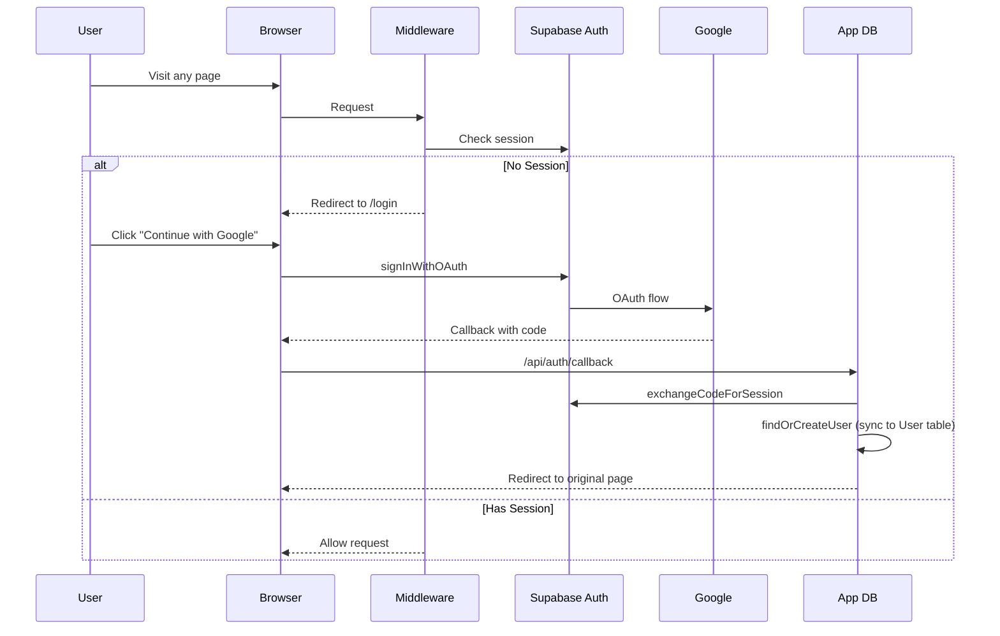

# Authentication & RBAC

## Auth Flow



## Setup: Enable Google OAuth

1. **Google Cloud Console**:
   - Go to [console.cloud.google.com](https://console.cloud.google.com)
   - Create OAuth 2.0 credentials (Web application)
   - Add authorized redirect URI: `https://YOUR-PROJECT.supabase.co/auth/v1/callback`

2. **Supabase Dashboard**:
   - Go to **Authentication → Providers → Google**
   - Enable Google provider
   - Paste Client ID and Client Secret

3. **Local Development**:
   - Also add `http://localhost:54321/auth/v1/callback` for local testing

## Roles

| Role | Level | Access |
|------|-------|--------|
| VIEWER | 0 | Browse KB, Query AI, view Docs |
| CONTRIBUTOR | 1 | All Viewer + Contribute (add/edit features) |
| REVIEWER | 2 | All Contributor + Review Queue (approve/reject) |
| ADMIN | 3 | Full access: Users, Glossary, LLM Config, Audit |

## Permission Matrix

| Action | VIEWER | CONTRIBUTOR | REVIEWER | ADMIN |
|--------|--------|-----------|----------|-------|
| View Dashboard | ✅ | ✅ | ✅ | ✅ |
| Browse KB | ✅ | ✅ | ✅ | ✅ |
| Query & Generate | ✅ | ✅ | ✅ | ✅ |
| View Dependencies | ✅ | ✅ | ✅ | ✅ |
| Read Docs | ✅ | ✅ | ✅ | ✅ |
| Contribute Features | ❌ | ✅ (own) | ✅ | ✅ |
| Approve/Reject | ❌ | ❌ | ✅ | ✅ |
| Admin Panel | ❌ | ❌ | ❌ | ✅ |
| Manage Users | ❌ | ❌ | ❌ | ✅ |

## How RBAC Works

### Middleware (`src/middleware.ts`)
- Runs on every request
- Checks Supabase session
- Redirects to `/login` if not authenticated
- Skips auth for public routes (`/login`, `/api/auth`)

### Sidebar (`src/components/Sidebar.tsx`)
- Fetches user profile via `GET /api/kb?action=user-profile`
- Filters nav items by `minRole` — hides items the user can't access
- Shows user avatar, name, and color-coded role badge

### API Role Checks (`src/app/api/kb/route.ts`)
- Write endpoints (POST) check user role
- CONTRIBUTOR+ can save features/scenarios
- ADMIN only can manage glossary bulk operations

### Role Hierarchy
```typescript
const ROLE_HIERARCHY = { VIEWER: 0, CONTRIBUTOR: 1, REVIEWER: 2, ADMIN: 3 };
function hasRole(userRole, requiredRole) {
  return ROLE_HIERARCHY[userRole] >= ROLE_HIERARCHY[requiredRole];
}
```

## Adding a New Role
1. Add to `Role` enum in `prisma/schema.prisma`
2. Run `npx prisma db push`
3. Add level to `ROLE_HIERARCHY` in `src/lib/rbac.ts`
4. Add color to `ROLE_COLORS` in `Sidebar.tsx`
5. Set `minRole` on nav items as needed

## User Management via API

```bash
# List users (admin only)
GET /api/users

# Update role (admin only)
POST /api/users
{ "email": "user@example.com", "role": "CONTRIBUTOR" }
```

## Files

| File | Purpose |
|------|---------|
| `src/lib/supabase-server.ts` | Server-side Supabase client (cookies) |
| `src/lib/supabase-browser.ts` | Client-side Supabase client |
| `src/lib/rbac.ts` | Role checks, user sync, user management |
| `src/middleware.ts` | Auth middleware (session check + redirect) |
| `src/app/login/page.tsx` | Login page with Google OAuth |
| `src/app/api/auth/callback/route.ts` | OAuth callback handler |
| `src/app/api/users/route.ts` | User management API (admin) |
