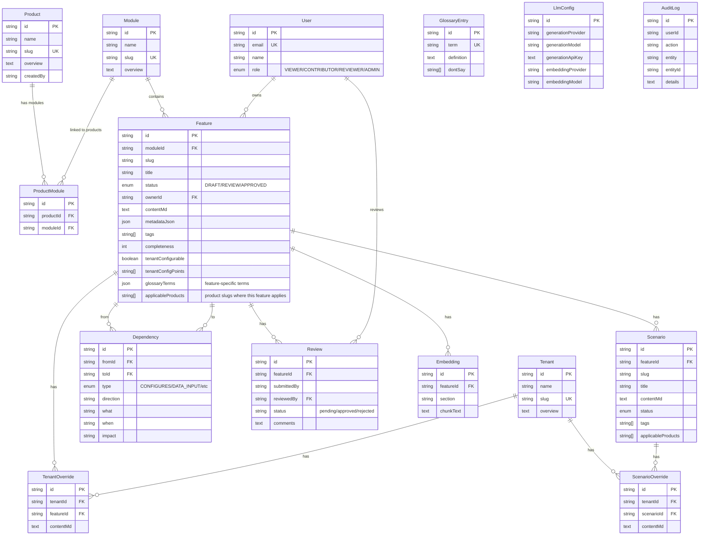

# Database Schema

## Setup

### Prerequisites
- Supabase project (free tier: [supabase.com](https://supabase.com))
- Node.js 20+

### Configuration

1. Copy `.env.example` to `.env.local`
2. Fill in Supabase credentials from your project dashboard:
   - `DATABASE_URL` — Connection pooler URL (port 6543, with `?pgbouncer=true`)
   - `DIRECT_URL` — Direct connection URL (port 5432)
   - `NEXT_PUBLIC_SUPABASE_URL` — Project URL
   - `NEXT_PUBLIC_SUPABASE_PUBLISHABLE_KEY` — Anon/public key

3. Run migrations:
```bash
npx prisma migrate dev --name init
```

4. Generate Prisma client:
```bash
npx prisma generate
```

---

## Entity Relationship Diagram



---

## Entity Hierarchy

```
Product (top-level)
  └── Module (grouping of features, N:M with products)
        └── Feature (knowledge document)
              └── Scenario (real-world workflow/flow)
```

- **Product** — Top-level entity (e.g., DMS, SFA, eB2B)
- **Module** — Logical grouping of features (e.g., Promotion, Inventory). A module can be linked to multiple products via the `ProductModule` join table.
- **Feature** — Core KB document. Belongs to exactly one Module, but `applicableProducts` lists which products it also applies to.
- **Scenario** — A detailed real-world workflow within a feature.

---

## Table Details

### Product
Top-level organizer. Each product (DMS, SFA, eB2B) groups modules.

| Column | Type | Notes |
|--------|------|-------|
| id | cuid | Primary key |
| name | string | Display name |
| slug | string | URL-safe, unique |
| overview | text | Markdown description |
| createdBy | string? | User who created |

### Module
Logical grouping of related features. Can be linked to multiple products.

| Column | Type | Notes |
|--------|------|-------|
| id | cuid | Primary key |
| name | string | Display name (e.g., "Promotion") |
| slug | string | URL-safe, unique |
| overview | text | Markdown description |

### ProductModule (join table)
Many-to-many link between Products and Modules.

| Column | Type | Notes |
|--------|------|-------|
| id | cuid | Primary key |
| productId | FK→Product | |
| moduleId | FK→Module | |
| | | Unique constraint on (productId, moduleId) |

### Feature
Core KB document. Contains structured knowledge.

| Column | Type | Notes |
|--------|------|-------|
| id | cuid | Primary key |
| moduleId | FK→Module | Parent module |
| slug | string | Unique within module |
| title | string | Display name |
| status | enum | DRAFT → REVIEW → APPROVED |
| ownerId | FK→User? | who owns this |
| contentMd | text | Full markdown content (all sections) |
| metadataJson | json | Extra metadata |
| tags | string[] | Searchable tags |
| completeness | int | 0-100% completeness score |
| tenantConfigurable | bool | Has tenant-configurable points? |
| tenantConfigPoints | string[] | List of config point names |
| glossaryTerms | json | Feature-specific term definitions (injected into AI context) |
| applicableProducts | string[] | Product slugs where this feature also applies beyond its module |

### Dependency
Feature-to-feature relationships.

| Column | Type | Notes |
|--------|------|-------|
| fromId | FK→Feature | Source feature |
| toId | FK→Feature | Target feature |
| type | enum | CONFIGURES, DATA_INPUT, TRIGGERS, VALIDATES, SETTLEMENT |
| direction | string | "incoming" or "outgoing" |
| what | string | What data/events flow between them |
| when | string | When this dependency activates |
| impact | string | What breaks if this changes |

### Embedding
Vector embeddings for semantic search. Stores chunks from **both features and scenarios**.

| Column | Type | Notes |
|--------|------|-------|
| featureId | FK→Feature | Source feature (shared by scenario chunks) |
| section | string | Section heading (`Rules`) or `scenario:{slug}:{section}` for scenarios |
| chunkText | text | Original prefixed chunk text |
| createdAt | DateTime | Index timestamp |

> **Note**: Embedding vectors are stored via pgvector. The embedding call is done at search time via the LLM adapter.

### ScenarioOverride
Tenant-specific overrides for a specific scenario workflow.

| Column | Type | Notes |
|--------|------|-------|
| tenantId | FK→Tenant | Which tenant this override applies to |
| scenarioId | FK→Scenario | Which scenario is overridden |
| contentMd | text | Markdown describing how the scenario flow differs for this tenant |

---

## Indexes

- `Product.slug` — unique
- `Module.slug` — unique
- `ProductModule.(productId, moduleId)` — compound unique
- `Feature.(moduleId, slug)` — compound unique
- `Scenario.(featureId, slug)` — compound unique
- `TenantOverride.(tenantId, featureId)` — compound unique
- `ScenarioOverride.(tenantId, scenarioId)` — compound unique
- `Dependency.(fromId, toId, type)` — compound unique
- `User.email` — unique
- `GlossaryEntry.term` — unique

---

## New Models (Content Ingestion)

### IngestionJob
Tracks ingestion sessions — persists sources, classified entities, and applied results.

| Column | Type | Notes |
|--------|------|-------|
| id | cuid | Primary key |
| status | string | `pending`, `classified`, `applied`, `failed` |
| sources | json | Array of source items (text/confluence/image) |
| classified | json | AI classification output (entities + summary) |
| appliedIds | json | Array of applied entity results |
| createdAt | DateTime | Job start time |
| updatedAt | DateTime | Last update time |

### ConfluenceConfig
Stores Atlassian Confluence API credentials — managed from Admin → Confluence tab.

| Column | Type | Notes |
|--------|------|-------|
| id | cuid | Primary key |
| baseUrl | string | Confluence instance URL (e.g., `https://company.atlassian.net/wiki`) |
| email | string | Atlassian account email |
| apiToken | text | Atlassian API token (encrypted at rest via Supabase) |
| createdAt | DateTime | Config creation time |
| updatedAt | DateTime | Last update time |

