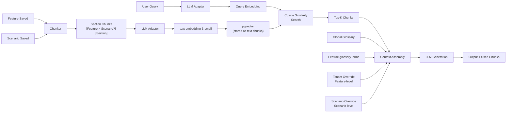

# Embedding Pipeline

## Architecture



## What Gets Embedded

| Source | Prefix Format | Section Key |
|--------|---------------|-------------|
| **Feature** `contentMd` | `[Feature Title] [Section]` | `## heading` name |
| **Scenario** `contentMd` | `[Feature Title > Scenario Title] [Section]` | `scenario:{slug}:{section}` |

Both share the `Embedding` table, linked by `featureId`. Scenario chunks are distinguished by section keys prefixed with `scenario:{slug}:`.

### Chunk Metadata

Each embedding record includes metadata about its module context:

| Metadata Field | Value |
|---------------|-------|
| `moduleSlug` | Slug of the feature's parent module (e.g., `promotion`) |
| `moduleName` | Display name of the module (e.g., `Promotion`) |

This allows search results to display module breadcrumbs and filtering by module.

## How Chunking Works

Markdown content is split at `##` headings. Each heading = one chunk:

```markdown
## What It Does         → Chunk 1: "What It Does"
Content here...

## Rules       → Chunk 2: "Rules"
Content here...
```

Chunks with no `##` headings are stored as a single `Overview` chunk.

Each chunk is prefixed before embedding so the vector captures both content AND context:

```
[Automatic Discount Calculation > BOGOF Scenario] [Step-by-Step Flow]
1. Rep selects product...
```

## Embedding Storage

| Column | Type | Description |
|--------|------|-------------|
| `id` | UUID | Primary key |
| `featureId` | CUID | Links to Feature (shared by scenarios) |
| `section` | String | Section heading (or `scenario:{slug}:{section}` for scenarios) |
| `chunkText` | Text | Full prefixed chunk text |
| `createdAt` | DateTime | Index timestamp |

## Re-indexing Behaviour

### Feature save
1. All existing **feature-level** embeddings deleted
2. Feature `contentMd` re-chunked and re-embedded

### Scenario save
1. Only scenario-specific embeddings deleted (`section startsWith "scenario:{slug}:"`)
2. Scenario `contentMd` re-chunked and re-embedded under same `featureId`

## Search & Filtering

The `searchSimilar` function supports filtering by module:

```sql
-- When moduleFilter is provided:
SELECT e.*, f."moduleId"
FROM "Embedding" e
JOIN "Feature" f ON e."featureId" = f.id
JOIN "Module" m ON f."moduleId" = m.id
WHERE m.slug = $moduleFilter
ORDER BY similarity DESC
LIMIT $topK
```

This scopes search results to features within a specific module, useful for module-focused queries.

## Context Assembly

`assembleContext()` builds the LLM context in this order:

1. **Global Glossary** (`GlossaryEntry` table) — definitions for all KB-wide terms
2. **Feature-Specific Terms** (`Feature.glossaryTerms` JSON) — terms from features that appeared in search results
3. **KB Context Chunks** — top-K similarity results (user can exclude individual chunks)
4. **Scenario-Level Tenant Overrides** (`ScenarioOverride`) — injected if tenant selected, scoped to features in context
5. **Feature-Level Tenant Overrides** (`TenantOverride`) — appended with PRIORITY note for selected tenant

## Context Priorities (LLM Instruction Order)

```
Global Glossary → Feature Terms → KB Chunks → Scenario Overrides → Feature Overrides
                                                        ↑
                                              Most authoritative for tenant-specific answers
```

## Tenant Override Injection

When a tenant is selected in Query & Generate:

### Feature-level overrides
```
## Tenant-Specific Feature Overrides (Unilever)
> These take PRIORITY over the default feature behavior.

### Override: Automatic Discount Calculation
- Custom slab: Buy 10 = 5%, Buy 20 = 12%
```

### Scenario-level overrides
```
## Scenario-Level Tenant Overrides
> These describe how specific scenarios work DIFFERENTLY for the selected tenant.

### Scenario Override: "BOGOF Flow" (Unilever)
- Extra manager approval step at ₹50,000 threshold
```

## API Endpoints

### `GET /api/search?q=...&module=...&topK=10`
Returns raw vector search results (chunks + similarity scores). Filter by `module` slug.

### `POST /api/generate`
Full RAG pipeline:
```json
{
  "query": "How does BOGOF work for Unilever?",
  "product": "dms",
  "tenant": "unilever-india",
  "topK": 10,
  "excludeChunkIds": []
}
```

Response:
- `output` — LLM-generated text
- `contextChunks` — all chunks used (with `moduleSlug`, `moduleName` for breadcrumbs)
- `tenantOverrides` — count of overrides (feature + scenario) injected
- `usage` — token counts

## Files

| File | Purpose |
|------|---------|
| `src/lib/embed-pipeline.ts` | `chunkFeature`, `embedFeature`, `embedScenario`, `searchByText`, `searchSimilar`, `assembleContext` |
| `src/lib/llm-adapter.ts` | Multi-provider abstraction (OpenAI, Gemini, Bedrock) |
| `src/app/api/search/route.ts` | Vector search endpoint |
| `src/app/api/generate/route.ts` | RAG generation endpoint (glossaryTerms + overrides injected) |
| `src/app/api/kb/route.ts` | KB CRUD — triggers `embedScenario` on scenario save |
| `src/app/api/llm-config/route.ts` | LLM configuration API |
