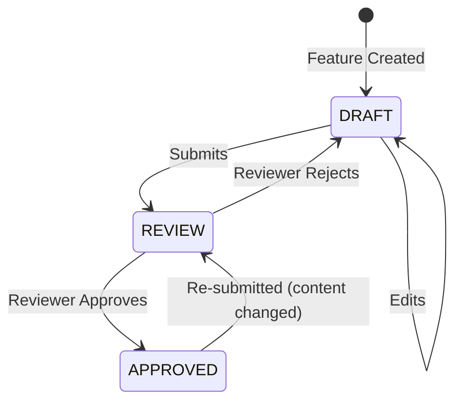

# Review Workflow

## State Machine



## Who Can Do What

| Action | VIEWER | CONTRIBUTOR | REVIEWER | ADMIN |
|--------|--------|-----------|----------|-------|
| Submit for Review | ❌ | ✅ (own) | ✅ | ✅ |
| Approve | ❌ | ❌ | ✅ | ✅ |
| Reject (with comments) | ❌ | ❌ | ✅ | ✅ |

## API

### `GET /api/reviews?status=pending`
Returns reviews filtered by status. Includes feature title and reviewer info.

### `POST /api/reviews`
Actions: `submit`, `approve`, `reject`

```json
// Submit
{ "action": "submit", "featureId": "..." }

// Approve
{ "action": "approve", "reviewId": "...", "comments": "Looks good" }

// Reject (comments required)
{ "action": "reject", "reviewId": "...", "comments": "Missing edge cases" }
```

## Audit Trail

Every review action is logged:
- `submitted` — feature ID + submitter
- `approved` — feature ID + reviewer + comments
- `rejected` — feature ID + reviewer + rejection reason

### `GET /api/audit?entity=feature&limit=50`
Admin-only audit log viewer with filtering and pagination.

## Files

| File | Purpose |
|------|---------|
| `src/app/api/reviews/route.ts` | Submit/approve/reject endpoints |
| `src/lib/audit.ts` | Audit logger (fire-and-forget) |
| `src/app/api/audit/route.ts` | Admin-only audit log API |
